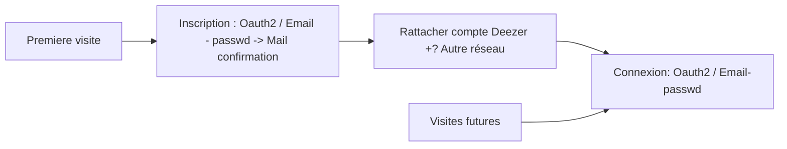

# MusicRoom
Music sharing app with Deezer API

## Views

 - Inscription ( premiere visite )
 - Connexion ( visites futures )
 - Choix du service 
	 - **Music Track Vote** : Génération live d’enchainement de musiques par vote. 
	 - **Music Control Delegation** : Délégation du contrôle de l’écoute. 
	 -  **Music Playlist Editor** : Édition de playlists à plusieurs en temps réel.
 - Page de profil
 - Page modification des comptes liés

## Structure



---

```mermaid
graph TD
A[Home] --> B[Choix du service]
A -->F[Page de Profil]
F -->G[Modifier comptes liés]
F -->H[Changer de mot de passe]
B --> C[Music Track Vote]
B --> D[Music Control Delegation]
B --> E[Music Playlist Editor]
