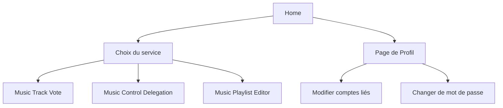

# Music Room
A Music playlist sharing crossplatform app in react-native & nodeJs 

## Set Up de l'environnement

### Back

``cd MusicRoom/Back`` 
``npm install`` 
installer mongodb https://docs.mongodb.com/manual/installation/ 
``mkdir /data/db`` 
``mongod`` (lance une instance de la base de données)  
``npm start`` (va lancer le serveur express sur le port 3000) 
``./ngrock http 3000`` ( assigne une adresse externe au serveur qui tourne sur le port 3000) 

PS: tout ça même pas besoin de le faire pour vous si je le run de chez moi.

###Front

``cd MusicRoom/Front`` 
``export ANDROID_SDK_ROOT=/Users/julien/Library/Android/sdk`` (sur mac) 
``npm install`` 
``npm start`` 
Connexion au Back : changer l’adresse du serveur ngrock dans API/Api.js ligne 1 

dans un autre terminal, dans /Front : 
``react-native run-android`` 

dans un autre terminal, encore dans /Front : 	 
``react-native log-android`` (affichera les sorties de la console)  

doc de l’Api https://documenter.getpostman.com/view/6579841/S1a7UQAv?version=latest#authentication 

## Views

 - Connexion ( premiere visite )
 - Connexion ( visites futures )
 - Choix du service 
	 - **Music Track Vote** : Génération live d’enchainement de musiques par vote. 
	 - **Music Control Delegation** : Délégation du contrôle de l’écoute. 
	 -  **Music Playlist Editor** : Édition de playlists à plusieurs en temps réel.
 - Page de profil
 - Page modification des comptes liés

## Structure

---

